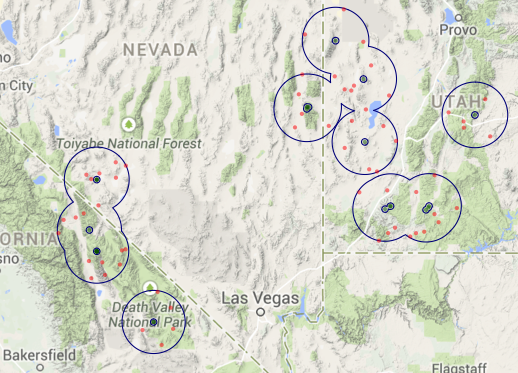

## Overview

- **Lecture 4a**: Guest speaker (Larry Crowder) Spatial ecological analysis and OBIS SEAMAP (Spatial Ecological Analysis of Megavertebrate Animal Populations)

- **Lecture 4b**: [Species Distribution Modeling with MGET](https://purl.org/net/frew/ESM296/wk4/MGET_SDM.pdf) (Best)

- **Lecture 4c**: [MGET Applications: Spatially Predictive Modeling & Mapping of Rockfishes](https://purl.org/net/frew/ESM296/wk4/SppDistModelingLab.pdf) (Wedding)
    
- **Lab 4**: [Species Distribution Modeling Lab using MGET](https://purl.org/net/frew/ESM296/wk4/ESM296-4F_SppDistModelingGISLab.pdf)

    - data: [Week4Data.7z](https://purl.org/net/frew/ESM296/wk4/Week4Data.7z)
    
    - [receiver operating characteristic (ROC) curves explained](./roc.html)

## Resources for Final Projects on SDM

### R Scripts

- [get_species.R](https://github.com/ucsb-bren/esm296-4f/blob/gh-pages/wk4/get_species.R) - download species observations from [gbif.org]() (Global Biodiversity Information Facility) and create shapefile of points

- [create_absences.R](https://github.com/ucsb-bren/esm296-4f/blob/gh-pages/wk4/create_absences.R) - create shapefile of pseudo-absence points from within buffer (specified by inner and outer rings) around shapefile of presence points. Also create map for quick sanity check. Here's the example map of created absence points (red) and buffers (blue) using presence points (green) for bristlecone pine (_Pinus longaeva_).

    

### Data sources

- Terrestrial

    - [WorldClim](http://www.worldclim.org) per [Hijmans et al (2005)](http://onlinelibrary.wiley.com/doi/10.1002/joc.1276/abstract)
    
    - [SoilGrids](http://www.soilgrids.org)

    - [Global 1-km Consensus Land Cover](http://www.earthenv.org/landcover.html) per [Tuanmu & Jetz (2014)](http://onlinelibrary.wiley.com/doi/10.1111/geb.12182/abstract)
      
    - [EarthEnv-DEM90 digital elevation model](http://www.earthenv.org/DEM.html) per [Robinson et al (2014)](http://www.sciencedirect.com/science/article/pii/S0924271613002360)
      

- Marine

    - [Bio-ORACLE](http://www.oracle.ugent.be) per [Tyberghein et al (2012)](http://onlinelibrary.wiley.com/doi/10.1111/j.1466-8238.2011.00656.x/full). Note: need to define projection as the Behrmann projected coordinate system.
    
    - [SRTM30_PLUS DEM](http://topex.ucsd.edu/WWW_html/srtm30_plus.html) per [Becker et al (2009)](http://topex.ucsd.edu/sandwell/publications/124_MG_Becker.pdf)

- General

    - [WorldGrids](http://worldgrids.org/doku.php)

## Data References

- Becker JJ, DT Sandwell, WHF Smith, J Braud, B Binder, J Depner, … P Weatherall (2009). [Global Bathymetry and Elevation Data at 30 Arc Seconds Resolution: SRTM30_PLUS](http://topex.ucsd.edu/sandwell/publications/124_MG_Becker.pdf). _Marine Geodesy_, 32(4): 355–371.

- Hijmans RJ, SE Cameron, JL Parra, PG Jones, A Jarvis. (2005). [Very high resolution interpolated climate surfaces for global land areas](http://onlinelibrary.wiley.com/doi/10.1002/joc.1276/abstract). _International Journal of Climatology_, 25(15): 1965–1978.

- Robinson N, J Regetz, RP Guralnick (2014). [EarthEnv-DEM90: A nearly-global, void-free, multi-scale smoothed, 90m digital elevation model from fused ASTER and SRTM data](http://www.sciencedirect.com/science/article/pii/S0924271613002360). _ISPRS Journal of Photogrammetry and Remote Sensing_, 87: 57–67.

- Tuanmu MN, W Jetz (2014) [A global 1-km consensus land-cover product for biodiversity and ecosystem modelling](http://onlinelibrary.wiley.com/doi/10.1111/geb.12182/abstract). _Global Ecology and Biogeography_, 23(9):1031–1045.

- Tyberghein L, H Verbruggen, K Pauly, C Troupin, F Mineur, O De Clerck (2012) [Bio-ORACLE: a global environmental dataset for marine species distribution modelling. Global Ecology and Biogeography](http://onlinelibrary.wiley.com/doi/10.1111/j.1466-8238.2011.00656.x/full), 21(2): 272–281.

## SDM References

- Elith J, JR Leathwick (2009) [Species Distribution Models: Ecological Explanation and Prediction Across Space and Time](https://purl.org/net/frew/ESM296/wk4/refs/Elith_Leathwick_2009.pdf). _Annual Review of Ecology, Evolution, and Systematics_, 40(1):677–697.

- Hijmans RJ, J Elith (2014) [Species distribution modeling with R](https://purl.org/net/frew/ESM296/wk4/refs/sdm.pdf). vignette for _[CRAN - Package dismo](http://cran.r-project.org/web/packages/dismo/index.html)_.

- Pearson RG (2007). [Species’ Distribution Modeling for Conservation Educators  and Practitioners](https://purl.org/net/frew/ESM296/wk4/refs/Pearson_2007.pdf).

- Roberts JJ, BD Best, DC Dunn, EA Treml, PN Halpin (2010) [Marine Geospatial Ecology Tools: An integrated framework for ecological geoprocessing with ArcGIS, Python, R, MATLAB, and C++](https://purl.org/net/frew/ESM296/wk4/refs/Roberts_etal_2010.pdf). _Environmental Modelling & Software_, 25(10):1197–1207.

- Young MA, PJ Iampietro, RG Kvitek, CD Garza (2010) [Multivariate bathymetry-derived generalized linear model accurately predicts rockfish distribution on Cordell Bank, California, USA](https://purl.org/net/frew/ESM296/wk4/refs/Young_etal_2010.pdf). _Marine Ecology-Progress Series_, 415:247–261.

- Zuur AF, EN Ieno, CS Elphick (2010) [A protocol for data exploration to avoid common statistical problems](
https://purl.org/net/frew/ESM296/wk4/refs/Zuur_etal_2009.pdf). Methods in Ecology and Evolution, 1(1):3–14.

