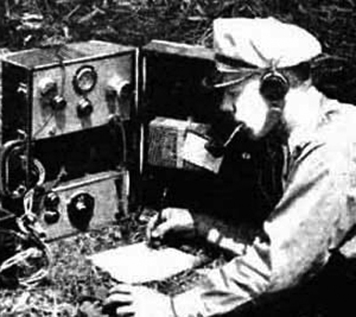
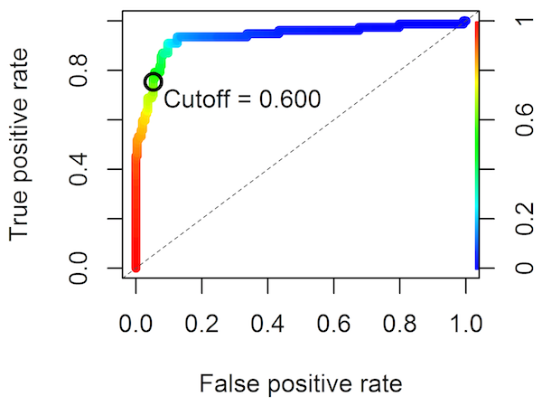
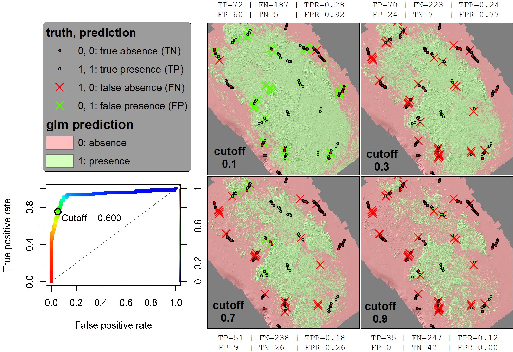

Receiver Operating Characteristic (ROC) curves were first developed during WWII for tuning radios.

Similarly, ROC curves can be used to tune species distribution model predictions which continuously range in value from 0 to 1. In this case the dial is a cutoff, any predicted value above which is called present (1) and below absent (0). Let's look again at the ROC diagnostic plot that you generated in lab 4 by running the Predict GLM From Table tool on just the test data using the fitted model.

The cutoff value corresponds to the color, legend on right vertical. At each cutoff value, errors are evaluated along the axes corresponding to the two types of errors possible with a binary prediction:

1.  **False positives** (FP) occurs when the GLM predicts presence of the species for a given location, when in fact our validation dataset says it does NOT occur there (ie predicted=1 but TestData=1 and presence=0). This is also known as an error of "commission", or Type I error. **False positive rate** (FPR; x axis of ROC plot above) is the number of false positives over all the known *positives* from the training dataset (ie TestData=1 and presence=1). The higher the FPR, the more false positives.

2.  **False negatives** (FN) occurs when the GLM predicts absence of the species for a given location, when in fact our validation dataset says it does occur there (ie predicted=0 but TestData=1 and presence=1). This is also called an error of "ommission", or Type II error. **True positive rate** (TPR; y axis of ROC plot above) is the number of false positives over all the known *negatives* from the training dataset (ie TestData=1 and presence=0). The higher the TPR, the fewer false negatives.

A model with a cutoff that predicts the test data exactly would produce zero false positives (FPR=0) and zero false negatives (TPR=1), placing its cutoff in the far upper left of this ROC plot. The closer to this corner the cutoff lies, the more accurate the model. The dashed diagonal line reflects the expectation of a random model getting half right, half wrong. Any improvement to the upper left beyond this diagonal is an overall measure of model performance summarized as the area under the curve (AUC), which is commonly reported in predictive modeling literature.

The 4 combinations for truth versus prediction give rise to the aptly named **confusion matrix**.

|||predicted|predicted|*rates*|
|--:|--:|:-------:|:-------:|:-----:|
|||*present (1)*|*absent (0)*||
|**truth**|*present (1)*|true positive (TP)|false negative (FN)|*TPR = TP / (TP + FN)*|
|**truth**|*absent (0)*|false positive (FP)|true negative (TN)|*FPR = FP / (FP + TN)*|

An ideal cutoff in the model maximizes true positives (TP) and true negatives (TN), while minimizing false positives (FP) and false negatives (FN). The true positive rate (TPR) rate is calculated from the numbers present from that row of truly present data, whereas the false positive rate is calculated from the numbers present in that row of truly absent data.

To fully understand how this plays out, let's look at how varying the cutoff value produces different predictive maps of habitat (in green).

Starting with a cutoff of 0.1, all continously ranging predicted values above 0.1 are assigned to 1, yielding the majority of the study area as species habitat. As the cutoff value increases, the species habitat shrinks, as does the number of false positives (ie predict species there, but truthfully not). However the number of false negatives increases (ie predict species not present, yet validation dataset says it is).

A common default cutoff to assign species habitat model optimizes the two rates to provide cutoff geometrically closest to that perfect upper left corner. For a highly endangered species such as the North Atlantic right whale (*Eubalaena glacialis*) the cutoff dial should be conservatively tuned to reduce falsely predicting species absence by producing a more expansive species range (fewer false negatives -\> higher true positive rate -\> lower cutoff value -\> towards upper right of ROC curve from optimal -\> greater area of species habitat).

