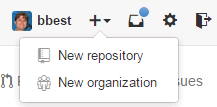
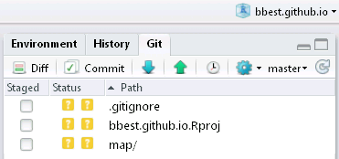

## Introduction

In the world of conservation, engaging a broad range of stakeholders is often vital to the success of a project. Interactive online maps provide a powerful visualization tool for exploring relevant spatial products.

Goals:

- Create GeoJSON files (using GDAL), which automatically get rendered with their own interactive map in Github. Do this for:

  - points
  
  - polygons  

- Create free public website using Github.

- Create your own interactive map with multiple layers, combining:

  - points
  
  - polygons
  
  - raster (as an image overlay)
  
  - background map of your choosing


## 1. Create Website

To share content on the web, let's get started with creating a pretty website.

Visit Github.com, login if needed, and create a new repository.



For the Repository name, enter your Github username.github.io and tick the box to Initialize this repository with a README. This will be your public website and you can add add a Description if you like.

Now go to your repository <span class="octicon octicon-tools"></span> Settings (right nav pane, lower), and click on the Automatic page generator.


Let's just go with the default home page for now (you can edit later) and Continue to layouts. Have fun choosing a layout aligned with your aesthetic sensibilities and Publish page.


You'll notice some webby files now in your repository: images, javascripts, stylesheets, and index.html. (The params.json is used internally for the automatic page generator.)

Now add https://USER.github.io (replacing USER with your Github username) to the Website entry at top next to Description and Save. Finally, check out your website! (Might take up to 10 minutes to appear)

## 2. Git clone website locally

Now let's get that website cloned locally to your machine so you can easily add and edit content. Launch Git Bash and enter the following commands, replacing FIRST LAST, USER, EMAIL variables with your own Github information. After setting these variables in the first couple lines, you can run the rest of the commands as is, since they use variable substitution.

```bash
# set to your own information
USER=bbest
FIRST_LAST="Ben Best"
EMAIL=bbest@nceas.ucsb.edu

# clone repo to H: drive class folder
git clone https://github.com/$USER/$USER.github.io.git /h/esm296-4f/$USER.github.io

# configure repo
cd /h/esm296-4f/$USER.github.io
git config user.name "$FIRST_LAST"
git config user.email $EMAIL
git config credential.helper wincred
git config push.default simple

# push test to ensure password saved
git touch test.md
git add test.md
git commit -m "testing"
git push
```

## 3. Get polygons of bristlecone pine distribution

Let's continuing with our pet organism the bristlecone pine (_Pinus longaeva_). Download the species distribution shapefile from this website:
  
  - [GECSC: Tree Species Distribution Maps for North America](http://esp.cr.usgs.gov/data/little/)

Unzip and create directories as needed so the shapefile and associated files live at this exact path:

```
H:\esm296-4f\lab5\raw\pinulong.shp
```

## 4. Generate points of bristlecone pine and create GeoJSON files

Let's also get observation points of bristlecone pine to provide another type of vector data to display.

Copy the following scripts into RStudio and save to your lab5 homework location, ie `H:\esm296-4f\github\lab5`:

- [`get_species.R`](https://github.com/ucsb-bren/esm296-4f/blob/gh-pages/wk4/get_species.R) pulls points from GBIF and outputs a shapefile

- [`create_geojson.R`](https://github.com/ucsb-bren/esm296-4f/blob/gh-pages/wk5/create_geojson.R) converts shapefile of points and polygons into GeoJSON

Change the input variable USER to your Github username for the second script and run both in sequence so you should then have the following:

- `H:\esm296-4f\lab5\raw\`
  - `pinulong.shp` - polygon shapefile
  - `pts_pinulong.shp` - point shapefile
- `H:\esm296-4f\bbest.github.io\map\`
  - `ply_pinulong.geojson` - polygon GeoJSON file
  - `pts_pinulong.geojson` - points GeoJSON file

Push these scripts in `H:\esm296-4f\github\lab5` to your Github site.

If the Git pane is not showing up in your "github" project, you will need to add the Git Bash path again: Tools > Global Options… Git/SVN > Git executable: Browse… and paste `C:\Program Files (x86)\Git\bin\git.exe`.

## 5. Open website files in RStudio and push GeoJSON files

Let's use RStudio to push these created GeoJSON files and edit the HTML of the site. Go to File > New Project... > Existing Directory. Navigate to your H:\esm296-4f\USER.github.io folder. I recommend not opening this in a new window to reduce confusion.

You should see in your Git pane the "map" folder containing the GeoJSON files and other two files created by the new RStudio project listed as untracked status.



Check all of these to add, commit and push to your repository. Now visit your Github site https://github.com/USER/USER.github.io and navigate to the *.geojson files in your map directory.

You should see the points and polygons automatically rendered by Github in a little zoomable map with clickable popups showing the given feature's attributes. Pretty cool!

<script src="https://embed.github.com/view/geojson/bbest/bbest.github.io/master/map/pts_pinulong.geojson"></script>

<script src="https://embed.github.com/view/geojson/bbest/bbest.github.io/master/map/ply_pinulong.geojson"></script>


## 6. Create Leaflet Mapper

But what about embedding these maps in your own website? And how about combining the points and polygons into a single map view?

To do this, we'll use the same Javascript library as Github: [Leaflet.js](http://leafletjs.com). Let's put this in a simple URL on your website USER.github.io/map. By default web servers generally serve up an index.html for any given folder. So copy the index.html in the root of your site into a new map folder. To do this in RStudio's Files pane, after creating New Folder map, tick index.html, More > Copy... `map/index.html`.

Now click on map/index.html > Open in Editor.

Let's fix the link to the stylesheet which is now, relative to the map folder, one directory up. While we're at it, let's add the stylesheet and script needed for Leaflet.

Replace this line:

```html
<link rel="stylesheet" type="text/css" media="screen" href="stylesheets/stylesheet.css">
```

with these:

```html
<link rel="stylesheet" type="text/css" media="screen" href="../stylesheets/stylesheet.css">
<link rel="stylesheet" href="http://cdn.leafletjs.com/leaflet-0.7.3/leaflet.css" />
<script src="http://cdn.leafletjs.com/leaflet-0.7.3/leaflet.js"></script>
<script src="http://calvinmetcalf.github.io/leaflet-ajax/dist/leaflet.ajax.min.js"></script>
```

Then in the body of the HTML, replace the contents of whatever is in between the following, ie `...`:

```html

    <!-- MAIN CONTENT -->
    <div id="main_content_wrap" class="outer">
      <section id="main_content" class="inner">

...    
 
      </section>
    </div>

    <!-- FOOTER  -->
```

And within the `...` above, insert the following:

```html
  <div id="map" style="width: 600px; height: 400px"></div>
  <script>

  	var map = L.map('map').setView([38, -115], 7);
        
    var Esri_NatGeoWorldMap = L.tileLayer('http://server.arcgisonline.com/ArcGIS/rest/services/NatGeo_World_Map/MapServer/tile/{z}/{y}/{x}', {
  attribution: 'Tiles &copy; Esri &mdash; National Geographic, Esri, DeLorme, NAVTEQ, UNEP-WCMC, USGS, NASA, ESA, METI, NRCAN, GEBCO, NOAA, iPC',
	maxZoom: 16
});
    Esri_NatGeoWorldMap.addTo(map)

	</script>
```

This should produce this interactive map:

```html
<link rel="stylesheet" href="http://cdn.leafletjs.com/leaflet-0.7.3/leaflet.css" />
<script src="http://cdn.leafletjs.com/leaflet-0.7.3/leaflet.js"></script>
<script src="http://calvinmetcalf.github.io/leaflet-ajax/dist/leaflet.ajax.min.js"></script>

<div id="map0" style="width: 600px; height: 400px"></div>
<script>

  var map = L.map('map0').setView([38, -115], 7);
      
  var Esri_NatGeoWorldMap = L.tileLayer('http://server.arcgisonline.com/ArcGIS/rest/services/NatGeo_World_Map/MapServer/tile/{z}/{y}/{x}', {
attribution: 'Tiles &copy; Esri &mdash; National Geographic, Esri, DeLorme, NAVTEQ, UNEP-WCMC, USGS, NASA, ESA, METI, NRCAN, GEBCO, NOAA, iPC',
maxZoom: 16
});
  Esri_NatGeoWorldMap.addTo(map0)

</script>
```

Next, add the following lines of code between `Esri_NatGeoWorldMap.addTo(map0)` and `</script>` to map the points and polygons:

```html
    // add GeoJSON of points
    var pts = new L.GeoJSON.AJAX('./pts_pinulong.geojson'); 
    pts.addTo(map)

    // add GeoJSON of points
    var ply = new L.GeoJSON.AJAX('./ply_pinulong.geojson'); 
    ply.addTo(map)
```

This should produce the following interactive map after you commit and push:

<link rel="stylesheet" href="http://cdn.leafletjs.com/leaflet-0.7.3/leaflet.css" />
<script src="http://cdn.leafletjs.com/leaflet-0.7.3/leaflet.js"></script>
<script src="http://calvinmetcalf.github.io/leaflet-ajax/dist/leaflet.ajax.min.js"></script>

<div id="map" style="width: 600px; height: 400px"></div>
<script>

  // add map
	var map = L.map('map').setView([38, -115], 7);
  
  // add basemap layer
  var Esri_NatGeoWorldMap = L.tileLayer('http://server.arcgisonline.com/ArcGIS/rest/services/NatGeo_World_Map/MapServer/tile/{z}/{y}/{x}', {
attribution: 'Tiles &copy; Esri &mdash; National Geographic, Esri, DeLorme, NAVTEQ, UNEP-WCMC, USGS, NASA, ESA, METI, NRCAN, GEBCO, NOAA, iPC',
maxZoom: 16
});
  Esri_NatGeoWorldMap.addTo(map)
  
  // add GeoJSON of points
  var pts = new L.GeoJSON.AJAX('./pts_pinulong.geojson'); 
  pts.addTo(map)

  // add GeoJSON of points
  var ply = new L.GeoJSON.AJAX('./ply_pinulong.geojson'); 
  ply.addTo(map)

</script>

Next, lets' 

TODO:

- Save https://raw.githubusercontent.com/calvinmetcalf/leaflet-ajax/master/dist/leaflet.ajax.min.js as `map/leaflet.ajax.min.js`.

- preview in browser before commit and push

- add link to main page.

- http://www.gdal.org/gdal2tiles.html, http://gis.stackexchange.com/questions/66986/gdal2tiles-py-generates-wrong-tiles-maptiler-the-right-ones

- Symbology of points to a tree marker


## Review

## Further Resources
- geojson.io

- [leafletjs.com: Tutorials](http://leafletjs.com/examples.html)
- [http://leaflet-extras.github.io/leaflet-providers/preview/](leaflet-extras.github.io: Leaflet Providers)
- [github.com: Mapping geoJSON files on GitHub](https://help.github.com/articles/mapping-geojson-files-on-github/)
- [zevross.com: Using R to quickly create an interactive online map using the leafletR package](http://zevross.com/blog/2014/04/11/using-r-to-quickly-create-an-interactive-online-map-using-the-leafletr-package/)
- [gdal.org: GeoJSON](http://www.gdal.org/drv_geojson.html)

- http://gitspatial.com/