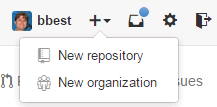
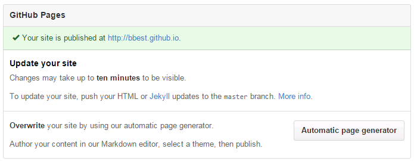
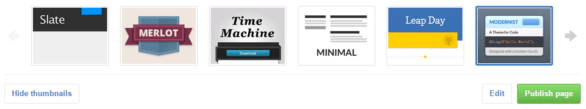

## Introduction

Goals:

- Create GeoJSON files (using GDAL), which automatically get rendered with their own interactive map in Github. Do this for:

  - points
  
  - polygons  

- Create free public website using Github.

- Create your own interactive map with multiple layers, combining:

  - points
  
  - polygons
  
  - raster (as an image overlay)
  
  - background map of your choosing
  

Continuing with pet organism bristlecone pine, googled _"Pinus longaeva" shapefile_ and found a distribution:
  
  - [GECSC: Tree Species Distribution Maps for North America](http://esp.cr.usgs.gov/data/little/)

## Create Website

To share content on the web, let's get started with creating a pretty website.

Visit Github.com, login if needed, and create a new repository.

For the Repository name, enter your Github username.github.io and tick the box to Initialize this repository with a README.

Go to Settings, Github Pages, click on Automatic page generator. 

Notice that although your repository is private this site will be public.

Accept the default project site info and click Continue to layouts. Have fun choosing one to your aesthetic sensibilities and Publish page.

You should see a notice like:

> Your project page has been created at http://bbest.github.io/esm296-4f. It may take up to 10 minutes to activate. Read more at https://help.github.com/pages.

Return to RStudio and pull the latest changes from the Git pane.

## Review